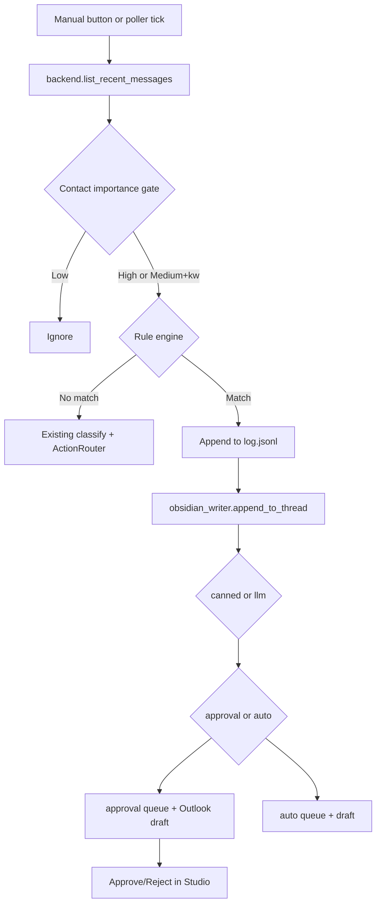

# Master Plan: Email Settings & Auto-Response Pipeline

**Source:** `.cursor/plans/email_settings_auto-response_b94c774f.plan.md` (architect draft)  
**Branch:** `feature/email-settings-auto-response`  
**MVP scope:** Drafts only (`AUTO_SEND_MODE=off`). Real Graph send is Phase 2 (out of scope).

## Phase map

| Phase | Plan | Agent | Depends on |
|-------|------|-------|------------|
| 1 | [phase1-email-settings-foundation.md](phase1-email-settings-foundation.md) | `@email-settings-foundation-agent` | — |
| 2 | [phase2-email-settings-llm.md](phase2-email-settings-llm.md) | `@email-settings-llm-agent` | Phase 1 |
| 3 | [phase3-email-settings-rule-engine.md](phase3-email-settings-rule-engine.md) | `@email-settings-engine-agent` | Phases 1–2 |
| 4 | [phase4-email-settings-api-poller.md](phase4-email-settings-api-poller.md) | `@email-settings-api-agent` | Phase 3 |
| 5 | [phase5-email-settings-ui.md](phase5-email-settings-ui.md) | `@email-settings-ui-agent` | Phase 4 |
| 6 | [phase6-email-settings-validation.md](phase6-email-settings-validation.md) | `@test-agent` + `@privacy-agent` | Phases 1–5 |

## Handoff

Use `.cursor/prompts/handoff-email-settings.md` at every phase boundary. Copy the checklist section and mark items before starting the next phase.

## Architecture (locked)

## Data files (created in Phase 1)

- `data/email_rules.yaml` — keyword rules
- `data/response_templates.yaml` — canned + LLM templates
- `data/queue/{approval,auto,log}.jsonl` — runtime queues (gitignored)
- `data/queue/poller_state.json` — poller cursor (gitignored)

## Phase 2 follow-up (not this branch)

- `Mail.Send` scope, `backend.send_message()`, real auto-send behind `AUTO_SEND_MODE`

## Global exit criteria

- [ ] All six phase plans moved to `completed/`
- [ ] `pytest` green for new test modules
- [ ] `ruff check .` and `black --check .` pass
- [ ] Studio Email Settings tab smoke-tested
- [ ] `data/queue/` gitignored; privacy rule documented
- [ ] PR merged to `main`
